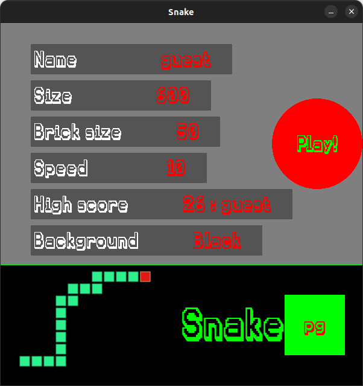
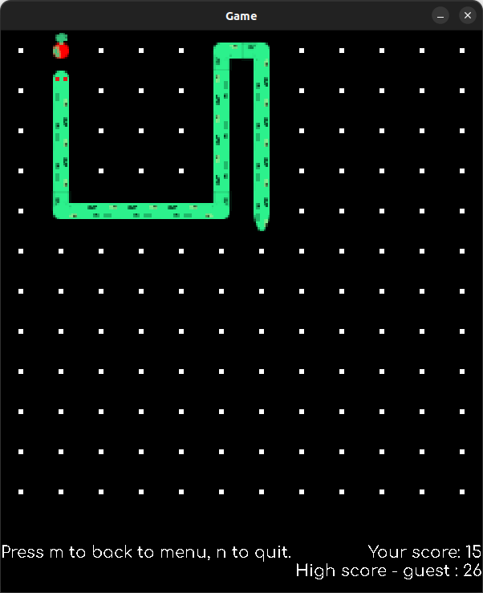
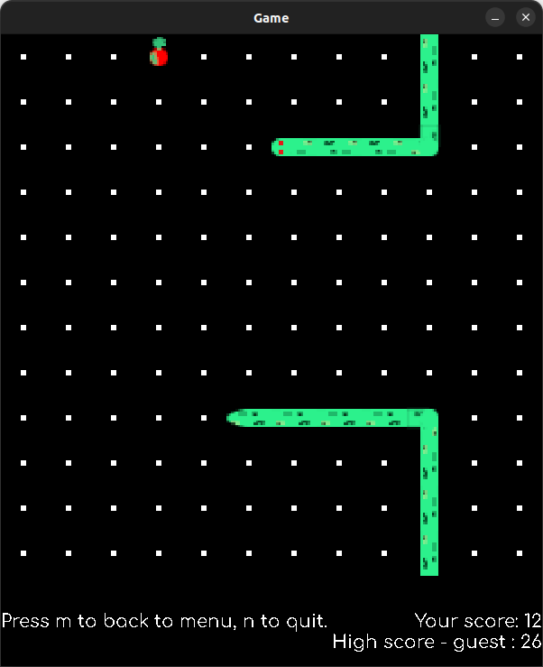

# Snake in PyGame

## What was the purpose of writing this program
My first mini project consisting of several files. I know that some parts can be hard to read, but for the first time it's not too bad and in the end it works and maybe I'm not objective, but the game is fun😁

## What it can do and what do you need
Just simple snake game. Instead of limiting the snake with walls, I decided to loop it. To run this you need Python and PyGame module. To change settings just click on the setting value. To change the name, first click on it (the cursor will not appear), write the name and press enter. To play just click on 'Play!'.
# Keys in game:
**w** - change direction to up \
**s** - change direction to down \
**a** - change direction to left \
**d** - change direction to right \
**m** - go back to menu \
**n** - quit the game 

_Main menu_ \

_In game_ \

_In game_ \

